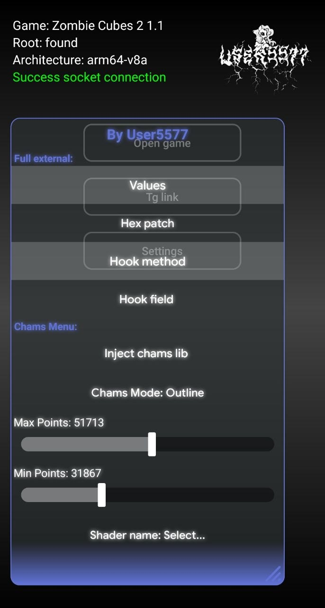

## Описание
Чит на мобильные игры.

## Окружение и сборка

Проект поддерживает сборку в AIDE CMODs и в Android Studio.


### Проверенная конфигурация для Android Studio:
* **Target SDK:** 34
* **NDK Version:** 26.1.10909125
* **Android Gradle Plugin (AGP):** 8.4.1
* **Gradle:** 8.6
* **JDK:** JetBrains Runtime / OpenJDK 17.0.14

---


## Краткий гайд по использованию

Для начала работы откройте директорию `app/src/main/jni/` и отредактируйте следующие файлы:

1. **`Main.cpp`** — Укажите имя пакета целевой игры (`packageName`) и настройте основные элементы меню/модификаций.
2. **`Memory.cpp`** — Реализуйте внутренний функционал для работы с памятью (внутри файла уже присутствует множество готовых примеров).
3. **`Chams.cpp`** — Если вам необходимы чамсы, найдите нужный шейдер и смещения (точки) на игрока, используя чит, после чего явно пропишите их конфигурацию в этом файле.

---


## Функционал и примеры кода


### 1. Патчинг памяти (.so) через HEX или ASM
Вы можете выполнить патч в контексте `.so` библиотеки, записав Hex-значение или ASM-инструкцию (например, `RET` для обхода функций):
```cpp
hexPatch(pkg, "0x2f696dc", "RET", "0", "libil2cpp.so");
```

### 2. Откат патча
Если необходимо вернуть оригинальные байты на место:
```cpp
resPatch(pkg, "0x2f696dc", "0", "libil2cpp.so");
```
### 3. Перенаправление вызова метода
Перенаправление вызова инструкции B (Branch) — например, для перехвата оригинального Update() и его перенаправления на ваш собственный метод:

```cpp
hookMethod(pkg, "0x8b38b8", "0x1043040", "libil2cpp.so");
```
### 4. Перезапись полей
Позволяет изменять значения конкретных полей объектов:

```cpp
hookField(pkg, "0xC4D4B0", "10.5", "0x88", "libil2cpp.so");
```
### 5. Поиск и запись значений (например, найденные в GameGuardian):

```cpp
int ExampleOn() {
    char* pkg = const_cast<char*>(processGame.c_str());
    initXMemoryTools(pkg, MODE_ROOT);
    SetSearchRange(A_ANONYMOUS);
    
    MemorySearch(OBF("1000"), TYPE_DWORD);
    MemoryWrite("2000", 0, TYPE_DWORD);
    ClearResults();
    
    return 0;
}
```
### 6. Инжект сторонних библиотек
Вы можете заинжектить libmain.so (сгенерированную из Chams.cpp) или любую другую кастомную .so библиотеку непосредственно в процесс игры:

```cpp
injectSO(packageName, "libmain.so"); 
```


---

## Требования
- **Наличие Root-прав:** (подойдет любой root, но не клонеры).

- **Архитектура:** `arm64-v8a`, `x86_64`.

- **Версия ОС:** Android 7.1+ (на более старых не тестировалось).

- **Совместимость:** Протестировано на огромном количестве устройств, популярных эмуляторах и в виртуальных пространствах.


---

## Известные проблемы и баги
Проблемы с инжектом Chams: Иногда чамсы могут не примениться с первого раза. Перезапустите игру и попробуйте снова. Если это не помогает, скорее всего, что у игры присутствует защита, блокирующая инжект.

Сборка в Android Studio: В Android Studio код в OffsetsPatch.h может собираться некорректно, из-за чего будут не верно определяться адреса для записи. В окружении AIDE CMODs данная проблема отсутствует.

Failed socket connection: Ошибка соединения сокета. Бывает при частых перезаходах, просто перезапустите приложение.


---

## Использованные open-source проекты
При создании данного чита использовались наработки и исходный код следующих проектов:

AndKittyInjector — для внедрения .so с чамсами.

Dobby — для тех самых чамсов.

MemoryTools — для поиска и записи значений.

Обратная связь
Если вы обнаружили баг, или у вас есть предложения по улучшению инструмента, можете связаться со мной:

- **Telegram:** `@User5577akaVlad`

- **YouTube:** `@vesaga57`
